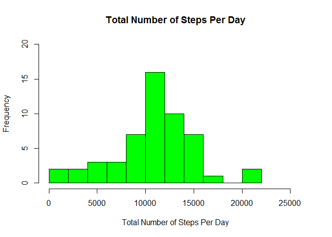
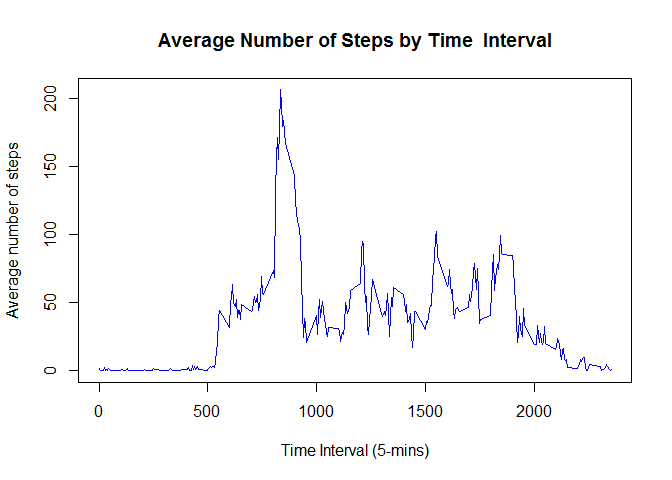
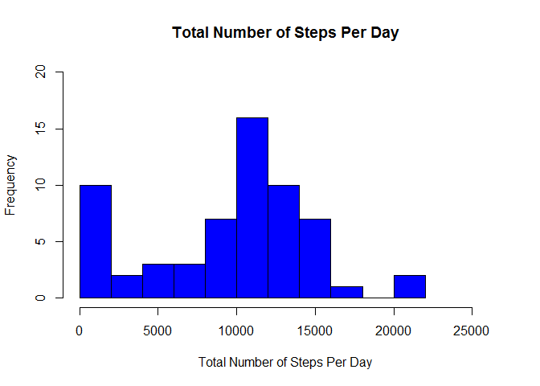
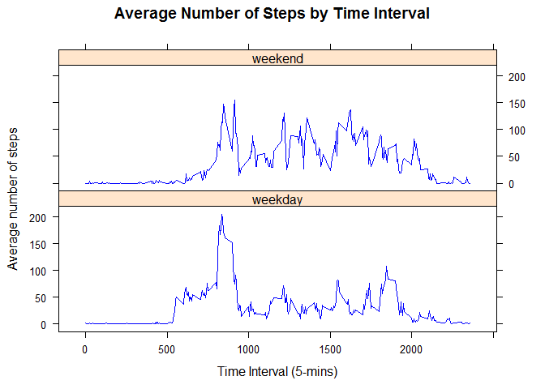

Load required libraries

    library(lattice)
    library(knitr)
    library(rmarkdown)

    ## Warning: package 'rmarkdown' was built under R version 3.3.2

    opts_chunk$set(echo=TRUE, warning=FALSE, message=FALSE, error=FALSE, collapse=TRUE,     tidy=TRUE, highlight=TRUE, comment='')
    #opts_knit$set(progress=TRUE, verbose=TRUE)

Loading and preprocessing the data
----------------------------------

    datafname = "activity.csv"
    zipfname = "repdata data activity.zip"  # this file should be placed in the working directory
    if (!file.exists(datafname)) {
        unzip(zipfname)
    }

    # Read data from activity.csv using read.csv function
    actdata <- read.csv("activity.csv", header = TRUE, colClasses = c("numeric", 
        "Date", "numeric"))

Print first few rows of data (this will give details of the columns)

    head(actdata)
      steps       date interval
    1    NA 2012-10-01        0
    2    NA 2012-10-01        5
    3    NA 2012-10-01       10
    4    NA 2012-10-01       15
    5    NA 2012-10-01       20
    6    NA 2012-10-01       25

Display summary of the data loaded

    # Display quick summary of the data loaded
    summary(actdata)
         steps             date               interval     
     Min.   :  0.00   Min.   :2012-10-01   Min.   :   0.0  
     1st Qu.:  0.00   1st Qu.:2012-10-16   1st Qu.: 588.8  
     Median :  0.00   Median :2012-10-31   Median :1177.5  
     Mean   : 37.38   Mean   :2012-10-31   Mean   :1177.5  
     3rd Qu.: 12.00   3rd Qu.:2012-11-15   3rd Qu.:1766.2  
     Max.   :806.00   Max.   :2012-11-30   Max.   :2355.0  
     NA's   :2304                                          

    # initialize min and max
    mindt <- min(actdata$date)
    maxdt <- max(actdata$date)
    durindays <- as.numeric(maxdt - mindt) + 1

What is mean total number of steps taken per day?
-------------------------------------------------

    # Remove rows with missing values
    cmpl_actdata <- actdata[complete.cases(actdata), ]  # data with only non-missing rows

    count_cmpl_cases <- nrow(cmpl_actdata)

    # Missing data
    incmpl_actdata <- actdata[!complete.cases(actdata), ]  ## data with only missing rows
    count_incmpl_cases <- nrow(incmpl_actdata)

    # Number of steps per day
    stps_per_day <- as.data.frame(tapply(cmpl_actdata$steps, INDEX = cmpl_actdata$date, 
        FUN = "sum", na.rm = TRUE))
    colnames(stps_per_day) <- "steps"
    # maximum number of steps among all the dates + some buffer to label x-axis
    max_num_steps <- max(stps_per_day) + 5000
    # plot histogram of frequency of the steps
    hist(stps_per_day$steps, main = "Total Number of Steps Per Day", xlab = "Total Number of Steps Per Day", 
        ylab = "Frequency", breaks = 10, xlim = c(0, max_num_steps), ylim = c(0, 
            20), col = "green")

    # Calculate and report the mean and median total number of steps taken per
    # day

    mean_num_steps <- format(mean(stps_per_day$steps, na.rm = TRUE), big.mark = ",", 
        scientific = F)
    median_num_steps <- format(median(stps_per_day$steps, na.rm = TRUE), big.mark = ",", 
        scientific = F)

    ## mean
    mean_num_steps
    [1] "10,766.19"

    ## meadian
    median_num_steps
    [1] "10,765"

What is the average daily activity pattern?
-------------------------------------------

    # Make a time series plot (i.e. type = 'l') of the 5-minute interval
    # (x-axis) and the average number of steps taken, coveraged across all days
    # (y-axis) calculate average number of steps by intervals without missing
    # values
    avg_num_stps_intvl <- as.data.frame(tapply(cmpl_actdata$steps, INDEX = cmpl_actdata$interval, 
        FUN = "mean", na.rm = TRUE))

    # Name the column as avg_steps
    colnames(avg_num_stps_intvl) <- "avg_steps"

    # Name rownames to interval
    avg_num_stps_intvl$interval <- rownames(avg_num_stps_intvl)
    row.names(avg_num_stps_intvl) <- NULL

    # display few observations from the top
    head(avg_num_stps_intvl)
      avg_steps interval
    1 1.7169811        0
    2 0.3396226        5
    3 0.1320755       10
    4 0.1509434       15
    5 0.0754717       20
    6 2.0943396       25

    # Plot a line graph of avg number of steps with 5-min interval

    plot(avg_num_stps_intvl$interval, avg_num_stps_intvl$avg_steps, type = "l", 
        xlab = "Time Interval (5-mins)", ylab = "Average number of steps", main = "Average Number of Steps by Time  Interval", 
        col = "blue")

    # Which 5-minute interval, on average across all the days in the dataset,
    # contains the maximum number of steps? Based on the above data analysis we
    # can see that the 5-miniutes interval with maximum number of average steps
    # per day is 835.

Imputing missing values
-----------------------

    # Calculate and report the total number of missing values in the dataset
    # (i.e. the total number of rows with NAs) Missing data
    incmpl_actdata <- actdata[!complete.cases(actdata), ]  ## data with only missing rows
    count_incmpl_cases <- nrow(incmpl_actdata)

    # Devise a strategy for filling in all of the missing values in the dataset.
    # The strategy does not need to be sophisticated. For example, you could use
    # the mean/median for that day, or the mean for that 5-minute interval, etc.
    # calculate median number of steps by intervals without missing values
    median_stps_intvl <- as.data.frame(tapply(cmpl_actdata$steps, INDEX = cmpl_actdata$interval, 
        FUN = "median", na.rm = TRUE))
    # Name calculated median column to median_steps
    colnames(median_stps_intvl) <- "median_steps"
    # Name rownames to interval
    median_stps_intvl$interval <- rownames(median_stps_intvl)
    row.names(median_stps_intvl) <- NULL
    mean_median <- merge(median_stps_intvl, avg_num_stps_intvl, by = "interval")
    # merge mean and median
    actdata_with_sum <- merge(actdata, mean_median, by = "interval")
    print("Print few records of clculated mean values.")
    [1] "Print few records of clculated mean values."
    head(actdata_with_sum)
      interval steps       date median_steps avg_steps
    1        0    NA 2012-10-01            0  1.716981
    2        0     0 2012-11-23            0  1.716981
    3        0     0 2012-10-28            0  1.716981
    4        0     0 2012-11-06            0  1.716981
    5        0     0 2012-11-24            0  1.716981
    6        0     0 2012-11-15            0  1.716981

    # Create a new dataset that is equal to the original dataset but with the
    # missing data filled in.

    for (i in (1:nrow(actdata_with_sum))) {
        if (is.na(actdata_with_sum$steps[i])) {
            actdata_with_sum$steps[i] <- actdata_with_sum$median_steps[i]
        }
    }

    actdata_no_miss <- actdata_with_sum[, c("steps", "date", "interval")]
    print("Summary of dataset with missing data filled ...")
    [1] "Summary of dataset with missing data filled ..."
    summary(actdata)
         steps             date               interval     
     Min.   :  0.00   Min.   :2012-10-01   Min.   :   0.0  
     1st Qu.:  0.00   1st Qu.:2012-10-16   1st Qu.: 588.8  
     Median :  0.00   Median :2012-10-31   Median :1177.5  
     Mean   : 37.38   Mean   :2012-10-31   Mean   :1177.5  
     3rd Qu.: 12.00   3rd Qu.:2012-11-15   3rd Qu.:1766.2  
     Max.   :806.00   Max.   :2012-11-30   Max.   :2355.0  
     NA's   :2304                                          

    # Make a histogram of the total number of steps taken each day and Calculate
    # and report the mean and median total number #of steps taken per day.
    # Number of steps on a particular date
    stps_per_day_nm <- as.data.frame(tapply(actdata_no_miss$steps, INDEX = actdata_no_miss$date, 
        FUN = "sum"))
    colnames(stps_per_day_nm) <- "steps"
    # maximum number of steps among all the dates + some buffer to label x-axis
    max_num_steps <- max(stps_per_day_nm) + 5000
    # plot histogram of frequency of the steps
    hist(stps_per_day_nm$steps, main = "Total Number of Steps Per Day", xlab = "Total Number of Steps Per Day", 
        ylab = "Frequency", breaks = 10, xlim = c(0, max_num_steps), ylim = c(0, 
            20), col = "blue")

    mean_num_steps_nm <- format(mean(stps_per_day_nm$steps), big.mark = ",", scientific = F)
    median_num_steps_nm <- format(median(stps_per_day_nm$steps), big.mark = ",", 
        scientific = F)

    # Create a new factor variable in the dataset with two levels – “weekday”
    # and “weekend” indicating whether a given date #is a weekday or weekend
    # day.

    # Logical variable - weekdays: Saturday and Sunday would be TRUE else FALSE
    actdata_no_miss$weekdays <- grepl("^[Ss]", weekdays(as.Date(actdata_no_miss$date)))

    for (i in (1:nrow(actdata_no_miss))) {
        if (actdata_no_miss$weekdays[i] == TRUE) {
            actdata_no_miss$week_day_factor[i] <- "weekend"
        } else {
            actdata_no_miss$week_day_factor[i] <- "weekday"
        }
    }
    # Check first few records
    head(actdata_no_miss)
      steps       date interval weekdays week_day_factor
    1     0 2012-10-01        0    FALSE         weekday
    2     0 2012-11-23        0    FALSE         weekday
    3     0 2012-10-28        0     TRUE         weekend
    4     0 2012-11-06        0    FALSE         weekday
    5     0 2012-11-24        0     TRUE         weekend
    6     0 2012-11-15        0    FALSE         weekday

    mean_stps_per_intvl_imput <- aggregate(actdata_no_miss$steps, by = list(actdata_no_miss$interval, 
        actdata_no_miss$week_day_factor), FUN = "mean", na.rm = TRUE)
    colnames(mean_stps_per_intvl_imput) <- c("interval", "weekday", "avg_steps")

    sort_order <- order(as.numeric(mean_stps_per_intvl_imput$interval))
    mean_stps_per_intvl <- mean_stps_per_intvl_imput[sort_order, ]

    mean_by_day_type <- aggregate(actdata_no_miss$steps, by = list(actdata_no_miss$week_day_factor), 
        FUN = "mean", na.rm = TRUE)
    mean_weekdays <- round(mean_by_day_type[1, 2], 2)
    mean_weekends <- round(mean_by_day_type[2, 2], 2)

    xyplot(data = mean_stps_per_intvl, avg_steps ~ as.numeric(interval) | as.factor(weekday), 
        type = "l", layout = c(1, 2), col = c("blue", "red"), main = "Average Number of Steps by Time Interval", 
        xlab = "Time Interval (5-mins)", ylab = "Average number of steps")

